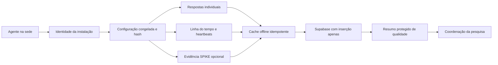

# Arquitetura de evidências distribuídas — PulseLab 1.4

> Status: fundação técnica para piloto controlado.
> Escopo: agente Windows, configuração versionada, Supabase, cache offline e resumo de qualidade.
> Não equivale, por si só, à validação científica do instrumento ou à aprovação ética da pesquisa.

## 1. Decisão de arquitetura

A versão 1.4 deixa de tratar o PulseLab apenas como um formulário que aparece em horários definidos. A unidade central passa a ser uma **sessão reconstruível**, composta por:

- respostas pseudonimizadas dos participantes;
- eventos operacionais em ordem temporal;
- evidências técnicas minimizadas;
- contexto da sede e da instalação;
- versão exata do protocolo e da configuração;
- indicadores de completude e problemas de qualidade.

O sistema amplia os “olhos” da coordenação para todas as sedes, mas não interpreta sozinho comportamentos complexos nem substitui julgamento científico. Seu papel é padronizar a coleta, demonstrar o que ocorreu e apontar sessões que exigem revisão.

## 2. Fluxo implementado



### 2.1 Antes da atividade

1. O agente carrega ou cria uma identidade persistente da instalação.
2. O instrutor confirma sede, regional, escola, oficina, turma e atividade.
3. A versão usada da configuração é congelada para a sessão e recebe hash SHA-256.
4. O instrutor confirma a verificação das autorizações aplicáveis.
5. Cada participante aceita ou recusa o convite de assentimento.
6. Somente após os dois assentimentos o agente autoriza a coleta.

### 2.2 Durante a atividade

1. Um cronômetro monotônico é iniciado e gera `activity_started`.
2. Heartbeats registram presença operacional do agente, categoria do aplicativo em primeiro plano, inatividade e detecção da janela do SPIKE.
3. Os checkpoints são calculados a partir do início real da atividade, e não do fim do questionário anterior.
4. Antes de abrir cada questionário, o agente coleta a evidência técnica daquele momento.
5. A e B respondem separadamente, com o papel atual registrado.
6. Problemas objetivos geram `quality_issue`.
7. A troca de papéis configurada é solicitada e confirmada.

### 2.3 Encerramento

1. O instrutor solicita o encerramento pelo ícone do agente.
2. A rubrica da dupla é preenchida.
3. Os participantes respondem separadamente ao pós-oficina.
4. O agente registra `session_completed` ou `session_aborted`.
5. O cache é sincronizado novamente.

## 3. Identidades e unidades de análise

| Campo | Duração | Finalidade |
|---|---:|---|
| `installation_id` | Persistente na máquina | Distinguir cada ponto de coleta e diagnosticar falhas recorrentes |
| `site_id` | Persistente, editável | Identificar a sede do projeto |
| `session_id` | Uma execução | Reunir todas as evidências da oficina |
| `dyad_id` | Uma execução | Representar a dupla sem nomear estudantes |
| `participant_id` | Uma execução | Distinguir A e B dentro da sessão |
| `workshop_code` | Informado pelo instrutor | Agrupar sessões da mesma oficina |
| `activity_id` | Configuração/sessão | Identificar a proposta pedagógica aplicada |

O arquivo `%LOCALAPPDATA%\PulseLab\installation.json` guarda somente o contexto operacional da instalação: UUID, sede, regional, escola, oficina, turma, atividade e tamanho do grupo. Esses valores reaparecem preenchidos para revisão na execução seguinte. A confirmação das autorizações é deliberadamente excluída do perfil e precisa ser renovada em cada oficina. O arquivo não deve conter nomes de estudantes.

## 4. Contratos de dados

### 4.1 `research_events`

Uma linha corresponde à resposta de um participante em uma fase:

- `pre`;
- `checkpoint`;
- `post`.

Além da resposta, cada linha carrega o contexto necessário para ser reenviada de forma independente. Checkpoints incluem:

- papel atual;
- etapa da atividade;
- tempo decorrido;
- horário previsto;
- horário da evidência;
- horário em que o questionário apareceu;
- atraso do checkpoint;
- categoria do aplicativo;
- inatividade;
- tamanho do último arquivo SPIKE;
- caminho privado da captura, quando aplicável.

`occurred_at` é o horário no computador da sede. `received_at` é o horário de chegada ao banco. A diferença ajuda a reconhecer períodos offline, mas relógios de máquinas ainda podem estar incorretos.

### 4.2 `research_session_events`

É uma linha do tempo append-only. O agente insere novos fatos e não recebe permissão para consultar, alterar ou excluir eventos.

| Evento | Significado |
|---|---|
| `session_started` | Autorizações e assentimentos concluídos; coleta iniciada |
| `phase_completed` | Pré ou pós-oficina encerrado |
| `activity_started` | Início do cronômetro da atividade |
| `heartbeat` | Agente ativo e contexto técnico mínimo |
| `checkpoint_started` | Evidência coletada e questionários iniciados |
| `checkpoint_completed` | Respostas A e B concluídas, recusadas ou expiradas |
| `help_requested` | Participante relatou necessidade imediata de ajuda |
| `role_swapped` | Troca de papéis confirmada |
| `ending_requested` | Instrutor solicitou o encerramento |
| `rubric_completed` | Rubrica da dupla registrada |
| `session_completed` | Fluxo completo encerrado |
| `session_aborted` | Fluxo interrompido depois de autorizada a coleta |
| `quality_issue` | Regra objetiva de qualidade foi violada |

`event_id` é um UUID único. Reenvios usam conflito ignorado por esse identificador, evitando duplicação quando a internet oscila.

### 4.3 `research_session_quality`

É uma view protegida destinada ao futuro backend do painel. Ela resume por sessão:

- quantidade de heartbeats;
- checkpoints esperados, iniciados e concluídos;
- quantidade de respostas pré, checkpoint e pós;
- recusas e timeouts;
- checkpoints com screenshot;
- número de problemas de qualidade;
- situação final.

Estados possíveis:

| Estado | Interpretação |
|---|---|
| `in_progress` | Ainda não há encerramento completo nem aborto |
| `aborted` | O agente registrou interrupção da sessão |
| `needs_review` | A sessão terminou, mas está incompleta ou possui alerta |
| `complete` | O conjunto mínimo esperado está presente e sem alerta automático |

`complete` significa **completude técnica**, não alta qualidade científica garantida. Uma sessão completa ainda pode conter respostas pouco confiáveis, aplicação inadequada da oficina ou problemas não observáveis pelo computador.

## 5. Regras automáticas de qualidade

Os códigos implementados nesta versão são:

| Código | Condição | Consequência |
|---|---|---|
| `checkpoint_late` | Evidência capturada depois do limite configurado | Revisar comparabilidade temporal |
| `spike_window_not_found` | Janela do SPIKE não foi localizada | Evidência técnica da atividade ficou reduzida |
| `screenshot_not_captured` | Captura estava habilitada, mas não foi produzida | Revisar máquina, janela ou permissão |
| `role_swap_not_confirmed` | Fluxo de troca foi encerrado sem confirmação | Comparação entre papéis pode ficar desequilibrada |

Outros sinais são registrados sem gerar automaticamente um problema:

- resposta recusada;
- resposta expirada;
- imagem capturada, mas aguardando upload;
- intervalo longo entre `occurred_at` e `received_at`;
- ausência de heartbeats durante um período.

O painel central deverá transformar esses sinais em filtros e filas de revisão. Os limites precisam ser definidos no protocolo antes da análise principal, para evitar decisões oportunistas depois de observar resultados.

## 6. Tempo e ordenação

Os minutos configurados são alvos absolutos medidos por `Stopwatch`, que não depende de mudanças manuais no relógio do Windows. O horário civil é preservado em paralelo para permitir reconstrução e comparação com o banco.

Exemplo:

- atividade começa às 09:00;
- checkpoint 20 é previsto para 09:20;
- A leva 70 segundos respondendo;
- B começa depois de A;
- checkpoint 40 continua previsto para 09:40, não para 09:41:10.

Isso impede que atrasos se acumulem silenciosamente entre checkpoints. O atraso de cada participante permanece registrado em `checkpoint_lateness_ms`.

## 7. Privacidade e minimização

A versão 1.4 aplica as seguintes restrições:

- não solicita nomes;
- usa IDs novos a cada sessão para participantes;
- não envia o título bruto da janela ativa;
- não envia o nome bruto de outros aplicativos;
- classifica o aplicativo apenas como `spike`, `other` ou `unknown`;
- captura somente a região da janela identificada do SPIKE;
- mantém o bucket de imagens privado;
- revoga leitura, atualização e exclusão para a chave usada pelo coletor;
- não registra respostas livres em `details`;
- inicia a coleta somente após os assentimentos.

A captura de tela continua sendo dado potencialmente sensível. Antes do piloto real, a instituição precisa definir base legal, comunicação aos responsáveis e participantes, retenção, pessoas autorizadas, resposta a incidentes e procedimento de exclusão.

## 8. Operação offline

Eventos não enviados ficam em `%LOCALAPPDATA%\PulseLab\cache\research-queue.json`. Capturas pendentes permanecem no mesmo diretório.

Quando um checkpoint depende de uma imagem local, a linha não é enviada sem ela. O agente aguarda o upload e depois envia a referência privada. Esse comportamento evita duas falhas:

- linha no banco indicando uma captura que foi perdida;
- arquivo local sem relação recuperável com a resposta.

A fila é tentada na inicialização, após checkpoints e no encerramento. O perfil da máquina deve ser preservado até que a sincronização termine.

O cache ainda não é criptografado em repouso. Em máquinas compartilhadas, isso precisa entrar na avaliação de risco e no próximo incremento de segurança.

## 9. Segurança e limite de confiança atual

O coletor usa a chave pública `anon`, com permissão somente de inserção. Isso reduz o dano de vazamento porque a chave não lê, altera nem apaga dados.

Essa configuração **não prova a origem do evento**. Quem obtiver a URL, a chave e o formato da API pode tentar inserir registros fabricados. Também não há, nesta versão, assinatura local ou atestado de integridade do executável.

Consequência prática:

- adequado para homologação e piloto supervisionado;
- útil para testar viabilidade, perdas, tempos e ergonomia;
- insuficiente para uma coleta acadêmica definitiva que exija garantia forte de autenticidade.

O próximo incremento de segurança deve usar identidade individual por instalação, credenciais revogáveis, rate limiting, validação no servidor e auditoria de provisionamento. A chave `service_role` nunca deve ser distribuída aos computadores.

## 10. Migração para 1.4

1. Fazer backup lógico ou snapshot do projeto Supabase.
2. Executar integralmente `schema/supabase-schema.sql` no SQL Editor.
3. Confirmar a criação de `research_session_events`.
4. Confirmar a criação da view `research_session_quality`.
5. Confirmar que `anon` possui `INSERT`, mas não `SELECT`, `UPDATE` ou `DELETE`, nas tabelas de coleta.
6. Publicar a configuração 1.4 no endereço definido por `config_remote_url`.
7. Gerar um novo instalador e atualizar cada máquina.
8. Executar uma sessão de homologação com internet.
9. Executar outra sessão começando offline e sincronizando depois.
10. Consultar o resumo de qualidade por um backend administrativo ou pelo SQL Editor.

Consulta de verificação administrativa:

```sql
select
    site_id,
    workshop_code,
    session_id,
    quality_status,
    heartbeat_count,
    checkpoint_completed_count,
    quality_issue_count
from public.research_session_quality
order by first_event_at desc;
```

Não se deve conceder acesso direto a essa view ao agente apenas para alimentar o painel. O painel central precisa de um backend autenticado e com autorização por perfil.

## 11. Critérios mínimos para o piloto

Uma rodada de homologação é aceita tecnicamente quando:

- a instalação mantém o mesmo `installation_id` em duas sessões;
- cada sessão recebe `session_started` e um desfecho;
- checkpoints ocorrem próximos dos alvos absolutos;
- respostas A e B preservam IDs e papéis corretos;
- a troca de papéis é refletida nos eventos seguintes;
- os hashes de configuração são iguais em máquinas com o mesmo protocolo;
- a fila offline sincroniza sem duplicar `event_id`;
- capturas não possuem URL pública;
- o resumo classifica corretamente uma sessão completa, uma incompleta e uma com alerta;
- nenhum payload contém nome, título bruto de janela ou resposta livre acidental.

## 12. O que fica para os próximos incrementos

Prioridade seguinte:

1. autenticação e provisionamento individual de dispositivos;
2. backend e painel real de cobertura, completude e alertas;
3. relógio confiável e diagnóstico de desvio entre cliente e servidor;
4. criptografia e política de expiração do cache local;
5. validação server-side dos contratos e limites de taxa;
6. matriz formal de acesso e retenção;
7. itens de conhecimento pré/pós alinhados às atividades;
8. piloto de concordância entre pesquisador humano e sinais do sistema;
9. automação de evidências objetivas da missão;
10. somente depois de análise ética específica, avaliar câmera ou áudio.

O painel real e a autenticação por instalação são deliberadamente separados desta entrega. A prioridade desta versão é produzir um registro coerente e mensurável antes de automatizar decisões em cima dele.
