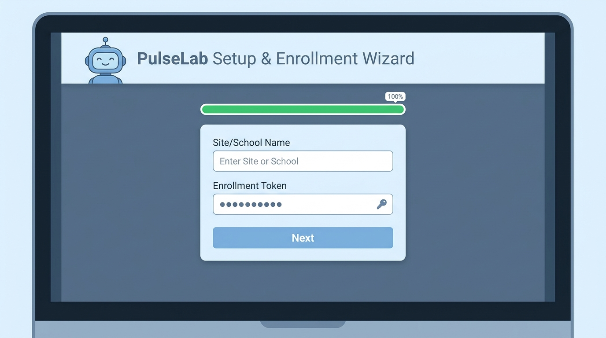
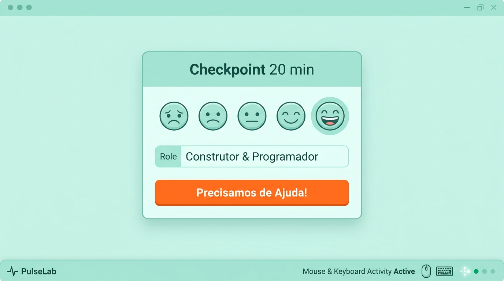
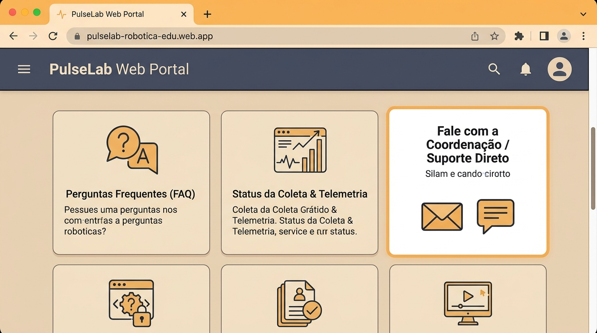

<!-- Slide 1: Capa -->

  
    Guia Operacional Passo a Passo
  
  <h1 style="font-size: 3rem; margin-top: 12px; color: #1e40af;">
    PulseLab 1.6.0
  </h1>
  

    Como instalar o pacote ZIP, conduzir oficinas de robótica, coletar telemetria de interação e concluir o ciclo pela bandeja do sistema.
  

  

    

      
📦

      <strong style="color: #1e3a8a; font-size: 0.95rem;">1. Instalação ZIP</strong>
      
Setup & Matrícula

    

    

      
🖱️

      <strong style="color: #166534; font-size: 0.95rem;">2. Uso & Telemetria</strong>
      
Cliques, Teclas & Checkpoint

    

    

      
📥

      <strong style="color: #6b21a8; font-size: 0.95rem;">3. Concluir na Bandeja</strong>
      
Botão Direito & Rubrica

    

    

      
🌐

      <strong style="color: #92400e; font-size: 0.95rem;">4. Web & Suporte</strong>
      
Portal & Fale Conosco

    

  

---

<!-- Slide 2: Etapa 1 - Instalação do Pacote ZIP -->
## Etapa 1 Como Instalar o Pacote ZIP

  

    <ul class="step-list">
      <li class="step-item">
        1
        
<strong>Baixar o ZIP:</strong> Baixe o arquivo compactado <code>PulseLab-1.6.0-Windows.zip</code> no computador da oficina.

      </li>
      <li class="step-item">
        2
        
<strong>Extrair Todo o Conteúdo:</strong> Clique com o botão direito sobre o <code>.zip</code> e escolha <em>"Extrair Tudo..."</em> em uma pasta local.

      </li>
      <li class="step-item">
        3
        
<strong>Executar Instalador:</strong> Abra a pasta extraída e dê dois cliques no executável <code>Instalar-PulseLab.bat</code>.

      </li>
      <li class="step-item">
        4
        
<strong>Matrícula e Token:</strong> Preencha Cidade/Escola e digite o <strong>Token de uso único</strong> fornecido pela coordenação.

      </li>
    </ul>

    

      ✨ <strong>Atalho Criado:</strong> O atalho <em>"Iniciar PulseLab - Oficina de Robótica"</em> será gerado na Área de Trabalho!
    

  

  

    
  

---

<!-- Slide 3: Etapa 2 - Como Usar na Oficina & Telemetria -->
## Etapa 2 Como Usar na Oficina & Telemetria

  

    <ul class="step-list">
      <li class="step-item">
        1
        
<strong>Início & Assentimento:</strong> O instrutor confere a turma e as crianças recebem o convite lúdico de participação.

      </li>
      <li class="step-item">
        2
        
<strong>Telemetria Automática:</strong> O PulseLab 1.6.0 contabiliza em segundo plano o volume agregado de <strong>cliques do mouse</strong> e <strong>teclas digitadas</strong> (sem registrar o que é digitado, preservando 100% a privacidade).

      </li>
      <li class="step-item">
        3
        
<strong>Checkpoints (20 e 40 min):</strong> Janelas leves surgem para avaliar esforço mental, humor da dupla e alternância de papéis.

      </li>
      <li class="step-item">
        4
        
<strong>Botão de Ajuda:</strong> O botão <em>"Precisamos de Ajuda!"</em> avisa o instrutor imediatamente.

      </li>
    </ul>
  

  

    
  

---

<!-- Slide 3: Etapa 3 - Como Encerrar o Ciclo pela Bandeja -->
## Etapa 3 Como Encerrar o Ciclo (Bandeja do Sistema)

  

    <ul class="step-list">
      <li class="step-item">
        1
        
<strong>Ícone na Bandeja:</strong> No canto inferior direito da tela (perto do relógio do Windows), localize o ícone de pulso do PulseLab.

      </li>
      <li class="step-item">
        2
        
<strong>Clique com o Botão Direito:</strong> Clique com o botão direito no ícone da bandeja e selecione <strong>"Concluir Oficina"</strong>.

      </li>
      <li class="step-item">
        3
        
<strong>Rubrica da Missão:</strong> O modal abre para o instrutor registrar as estrelas de desempenho LEGO e intervenções.

      </li>
      <li class="step-item">
        4
        
<strong>Autoavaliação & Sincronização:</strong> Os alunos respondem ao feedback final e a sessão é enviada à nuvem Supabase.

      </li>
    </ul>
  

  

    
  

---

<!-- Slide 4: Etapa 4 - Web Portal & Suporte -->
## Etapa 4 Web Portal, Dúvidas & Fale Comigo

  

    

      <strong style="color:#92400e;">🌐 Web Portal do PulseLab:</strong>
      
Acesse <a href="https://pulselab-robotica-edu.web.app" target="_blank" style="color:#b45309; font-weight:700;">pulselab-robotica-edu.web.app</a> para acessar o Portal do Instrutor, baixar atualizações e consultar dashboards.

    

    

      <strong style="color:#334155;">📶 Offline & Resiliência:</strong>
      
Se a internet cair, todas as respostas e telemetria ficam salvas no cache seguro local e sincronizam no próximo sinal.

    

    

      💬 <strong>Dúvidas ou Suporte?</strong> Fale diretamente com a coordenação do projeto pelo canal institucional ou abra um chamado no portal.
    

  

  

    
  

